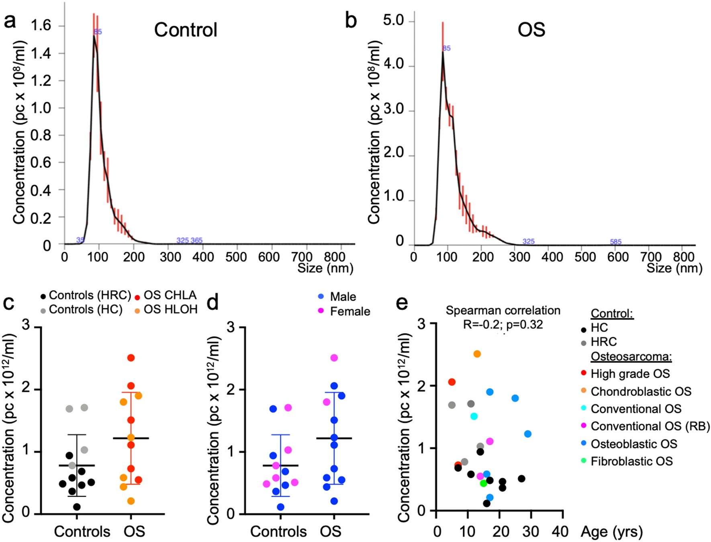
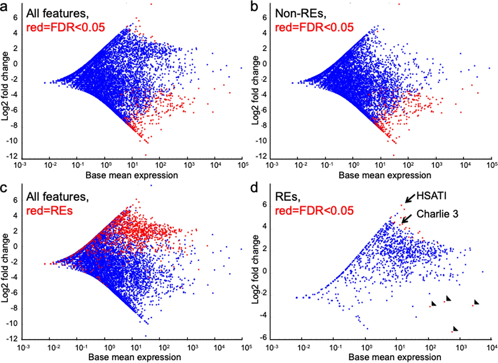
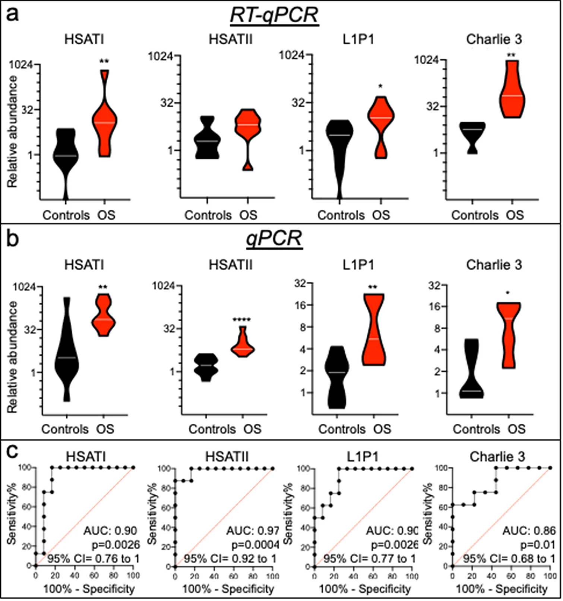
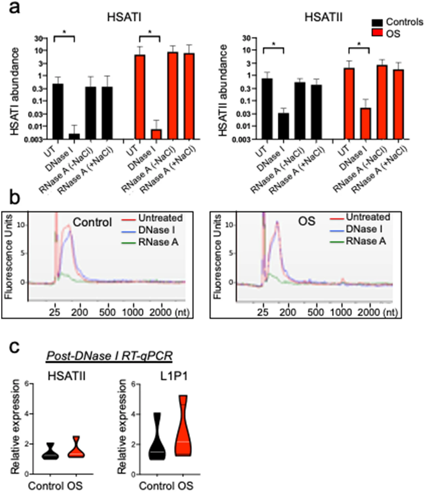
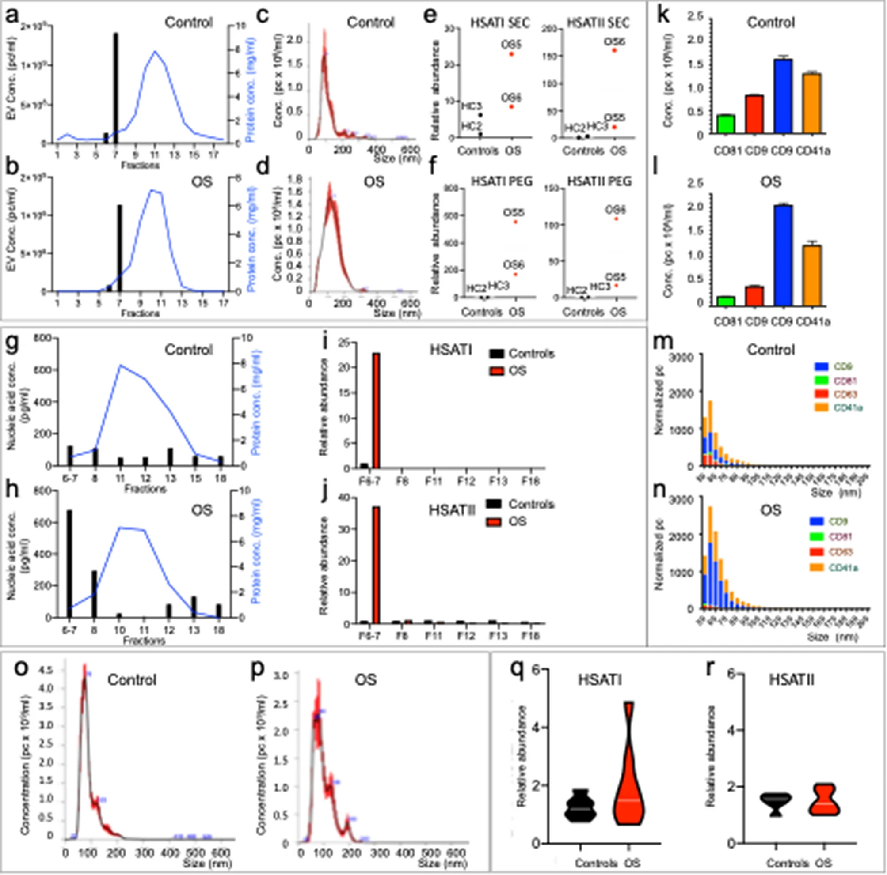
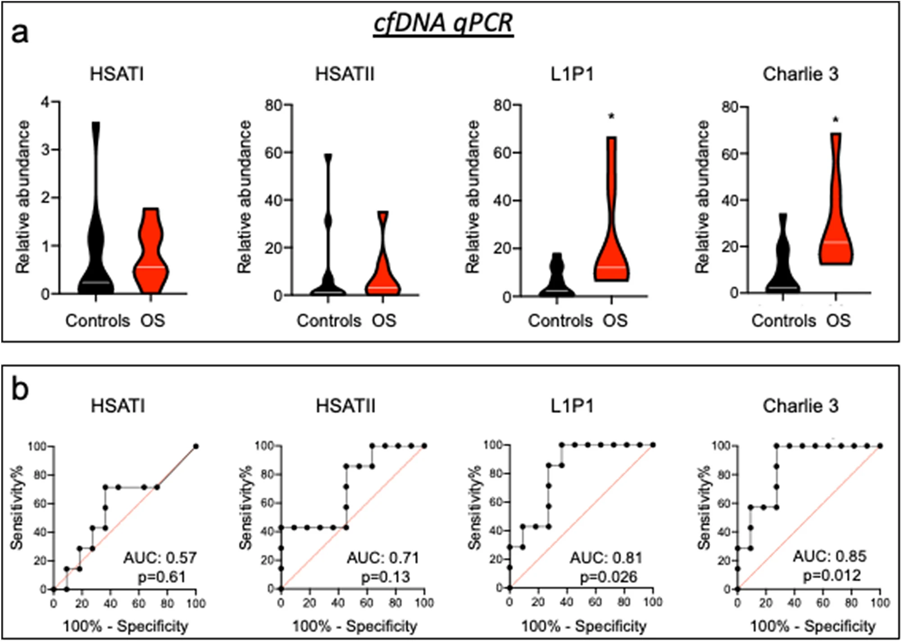

<!-- README.md is generated from README.Rmd. Please edit that file -->

```{r, include = FALSE}
knitr::opts_chunk$set(
  collapse = TRUE,
  comment = "#>"
)
```

# Extracellular vesicle‐associated  repetitive element DNAs  as candidate osteosarcoma  biomarkers

Osteosarcoma (OS) is the most common malignant bone tumor in children and young adults. Despite that high‐risk factors have been identified, no test for early detection is available. This study aimed to identify circulating nucleic acid sequences associated with serum extracellular vesicle (EV) preparations at the time of OS diagnosis, as a step towards an OS early detection assay. Sequencing of small nucleic acids extracted from serum EV preparations revealed increased representation of diverse repetitive element sequences in OS patient versus control sera. Analysis of a validation cohort using qPCR of PEG‐precipitated EV preparations revealed the over‐representation of HSATI, HSATII, LINE1-P1, and Charlie 3 at the DNA but not RNA level, with receiver operating characteristic (ROC) area under the curve (AUC) ≥ 0.90. HSATI and HSATII DNAs co‐purified with EVs prepared by precipitation and size exclusion chromatography but not by exosome immunocapture, indicative of packaging in a non‐exosomal complex. The consistent over‐representation of EV‐associated repetitive element DNA sequences suggests their potential utility as biomarkers for OS and perhaps other cancers.

## Patient EV preparation characteristics. 



## Over-representation of repetitive elements in OS EV–associated sequences. 

MA plot for sequence features differentially represented in control and OS serum EV preparations as defined by TEtranscripts analysis



## Over-representation of repetitive elements in OS compared to control EV preparations in a validation cohort. 



## Repetitive element sensitivity to DNase in EV preparations.



## Co-purification of OS-associated repetitive element DNAs with EVs in size exclusion chromatography but not exosome immunoaffinity capture.



## Human satellite sequences not enriched in total cfDNA in OS patient sera.

